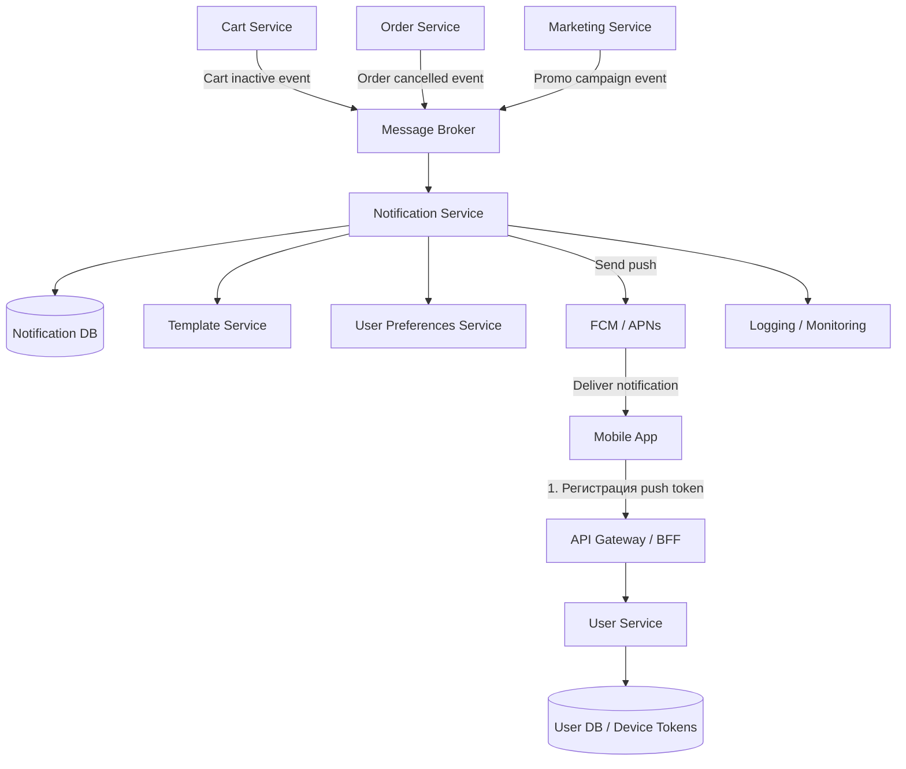

# Описание архитектуры PUSH-уведомлений

```mermaid
flowchart TD
    A[Mobile App] -->|1. Регистрация push token| B[API Gateway / BFF]
    B --> C[User Service]
    C --> D[(User DB / Device Tokens)]

    E[Cart Service] -->|Cart inactive event| H[Message Broker]
    F[Order Service] -->|Order cancelled event| H
    G[Marketing Service] -->|Promo campaign event| H

    H --> I[Notification Service]
    I --> J[(Notification DB)]
    I --> K[Template Service]
    I --> L[User Preferences Service]

    I -->|Send push| M[FCM / APNs]
    M -->|Deliver notification| A

    I --> N[Logging / Monitoring]
```
