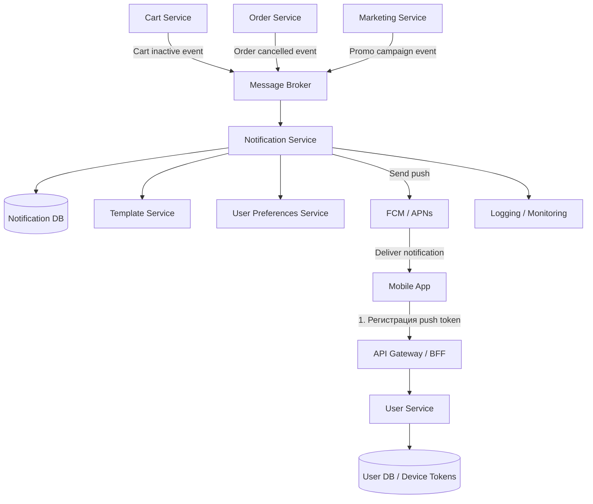

# Описание архитектуры PUSH-уведомлений

## Верхнеуровневая архитектура

## Логика работы

1. Пользователь устанавливает мобильное приложение и разрешает пуш-уведомления.
2. Мобильное приложение получает pushToken от FCM/APNs и отправляет его на backend.
3. Backend сохраняет токен устройства в базе. Желательно хранить не только токен, но и userId, deviceId, платформу, статус токена и дату последнего обновления.
4. Разные микросервисы создают события. Например:
    * CartInactive - товар долго лежит в корзине;
    * OrderCancelled - заказ отменен;
    * MarketingCampaignStarted - рекламная рассылка.
5. События попадают в брокер сообщений: Kafka или RabbitMQ.
6. Notification Service читает события, проверяет настройки пользователя, выбирает шаблон уведомления и формирует push.
7. Push отправляется через FCM/APNs на устройство пользователя.
8. Результат отправки логируется: успешно отправлено, ошибка, токен невалиден, пользователь отключил пуши.

## Основные компоненты

| Компонент | Тип | Описание | Зона ответственности |
|----------|-----|----------|----------------------|
| Mobile App | Клиент | Мобильное приложение пользователя | Получение push token, отображение уведомлений |
| API Gateway / BFF | Backend | Точка входа для мобильного клиента | Прием запросов, проксирование в сервисы |
| User Service | Микросервис | Сервис управления пользователями | Хранение пользователей и привязка устройств |
| Device Tokens DB | Хранилище | База данных токенов устройств | Хранение push-токенов, deviceId, platform |
| Cart Service | Микросервис | Сервис корзины | Генерация событий о неактивной корзине |
| Order Service | Микросервис | Сервис заказов | Генерация событий об изменении статуса заказа |
| Marketing Service | Микросервис | Сервис маркетинга | Генерация рекламных и массовых рассылок |
| Message Broker (Kafka / RabbitMQ) | Инфраструктура | Шина сообщений | Передача событий между сервисами |
| Notification Service | Микросервис | Сервис уведомлений | Формирование и отправка push-уведомлений |
| Template Service | Микросервис / модуль | Сервис шаблонов | Хранение и управление текстами уведомлений |
| User Preferences Service | Микросервис | Сервис настроек пользователя | Проверка согласий на получение уведомлений |
| Notification DB | Хранилище | База уведомлений | Хранение истории отправок и статусов |
| FCM / APNs | Внешний сервис | Платформенные сервисы доставки push | Доставка уведомлений на устройства |
| Logging / Monitoring | Инфраструктура | Система логирования | Отслеживание ошибок, статусов и метрик |
